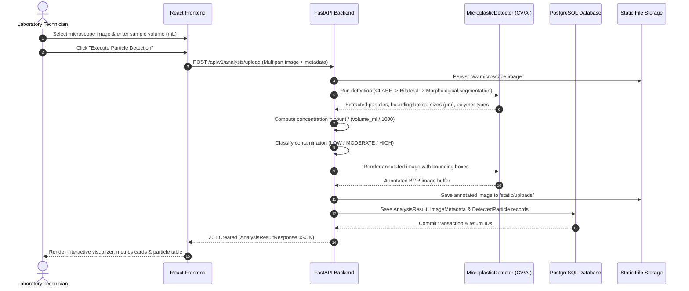

# System UML Diagrams

## 1. Microscope Image Analysis Sequence Diagram

```mermaid
sequenceDiagram
    autonumber
    actor LabTech as Laboratory Technician
    participant UI as React Frontend
    participant API as FastAPI Backend
    participant Engine as MicroplasticDetector (CV/AI)
    participant DB as PostgreSQL Database
    participant FS as Static File Storage

    LabTech->>UI: Select microscope image & enter sample volume (mL)
    LabTech->>UI: Click "Execute Particle Detection"
    UI->>API: POST /api/v1/analysis/upload (Multipart image + metadata)
    API->>FS: Persist raw microscope image
    API->>Engine: Run detection (CLAHE -> Bilateral -> Morphological segmentation)
    Engine-->>API: Extracted particles, bounding boxes, sizes (µm), polymer types
    API->>API: Compute concentration = count / (volume_ml / 1000)
    API->>API: Classify contamination (LOW / MODERATE / HIGH)
    API->>Engine: Render annotated image with bounding boxes
    Engine-->>API: Annotated BGR image buffer
    API->>FS: Save annotated image to /static/uploads/
    API->>DB: Save AnalysisResult, ImageMetadata & DetectedParticle records
    DB-->>API: Commit transaction & return IDs
    API-->>UI: 201 Created (AnalysisResultResponse JSON)
    UI-->>LabTech: Render interactive visualizer, metrics cards & particle table
```
